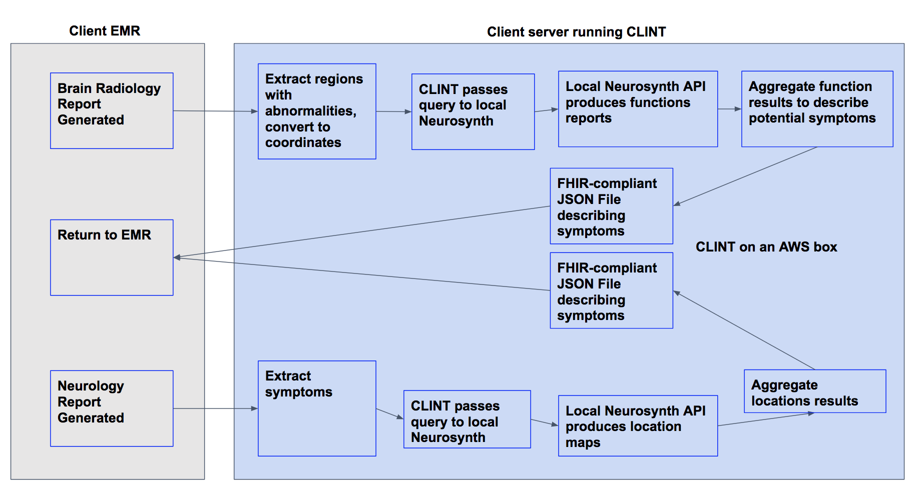

# CLINT (CLInical Neurosynth Translator)
### An electronic medical record (EMR) pipeline using neurosynth to link clinical data with fMRI research literature
##### Hackathon team: Lead: Dylan M. Nielson - SysAdmins: Ben Cohen, Meghna Verma, Zehai Wang - Writers: Mostafa Lotfi, Ben Cohen, Dylan M. Nielson, Meghna Verma, Zehai Wang

#### How to cite this work in a publication:  (doi: )

**CLINT** is a data gathering and query pipeline that will parse electronic medical record (EMR) reports, interface with Neurosynth to produce a list of symptoms correlated to structures or structures correlated to symptoms queried and return a report in an EMR ingestible format.
[Neurosynth](http://neurosynth.org/) is a database of functional neuroimaging results linking function with brain locations from over 11,000 published functional magnetic resonance imaging (fMRI) studies.

This project was part of the [Spring 2018 NCBI Hackathon](https://docs.google.com/document/d/18LTB50P15sEGclj4fEFyk3_EftxbiZ5HiMomv0yRuLQ/edit)

## Application 1
Clinical radiology reports indicate the structures involved in any clinical finding, but might not mak$

## Application 2
Similarly, sometime it takes a long time to get a patient into the scanner, if you know what symptoms $

## Application 3
When searching for patients to enroll in clinical trials study directors could provide a list of desired patient symptoms and CLINT could output the corresponding anatomical mask and EMRs

In a perfect world here's how CLINT might work:

## Dependencies:computer:

*Software*: 
[Neurosynth](http://neurosynth.org/)
[Docker](https://www.docker.com/)

### Databases
EMR's:[OHDSI/ETL-CMS github](https://github.com/OHDSI/ETL-CMS)
Brain Atlas:
[FMRIB Software Library Main page](https://fsl.fmrib.ox.ac.uk/fsl/fslwiki)
[FMRIB Software Library Atlases](https://fsl.fmrib.ox.ac.uk/fsl/fslwiki/Atlases)
[FSL-Harvard-Oxford-Atlases](http://neuro.debian.net/pkgs/fsl-harvard-oxford-atlases.html)

## Workflow Implementation
In order to implement CLINT follow the steps below:

Step 1.

## Sample Outputs

Todo:
1. Get a better name
2. Find Data
3. Parse reports
4. Query Neurosynth
5. Aggregate Neurosynth reports
6. Create FHIR JSON
7. Containerize endpoint and drop it on an AWS box

#### Acknowledgements
[MetagenomicsAntibioticResistance github](https://github.com/NCBI-Hackathons/MetagenomicAntibioticResistance/blob/master/README.md) used as a template for formatting and organization

