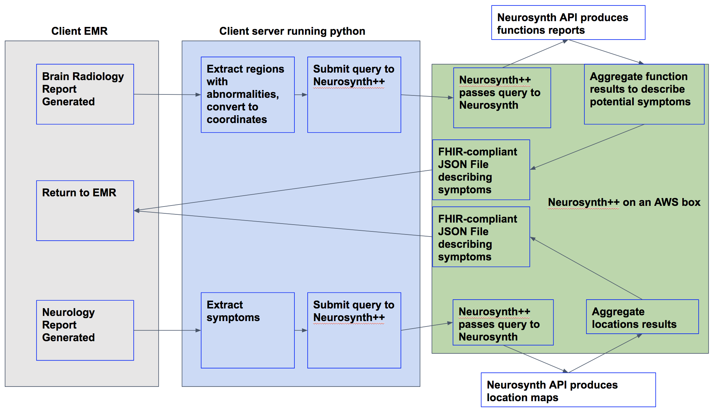

# Neurosynth++ (Name to be improved)
Linking clinical insights with research literature

[Neurosynth](http://neurosynth.org/) is a database of functional neuroimaging results linking function with brain locations from over 11,000 published fMRI studies. 

# Aim 1
Clinical radiology reports indicate the structures involved in any clinical finding, but might not make it clear what those structures do. We'll parse those reports and grab related regions from neurosynth and return a report in an EHR ingestible format. 

# Aim 2
Similarly, sometime it takes a long time to get a patient into the scanner, if you know what symptoms a patient has, we can try to guess which region of the brain is involved, and return those results in an EHR ingestible format.

# Aim 3
Go directly from an image to other image databases and find the most similar scans (definition TBD) and their metadata.

In a perfect world here's hour Neurosynth++ might work:

Todo:
Get a better name
Find Data
Parse reports
Query Neurosynth
Aggregate Neurosynth reports
Create FHIR JSON
Containerize endpoint and drop it on an AWS box
